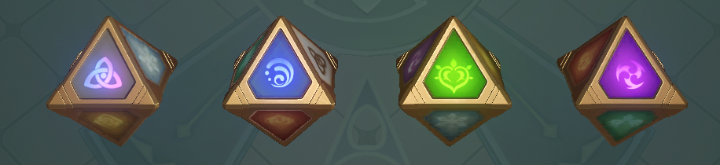
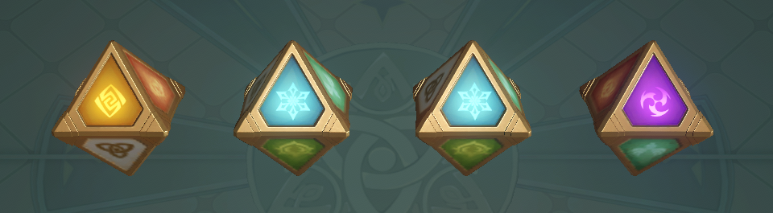

# ProudCarrot的七圣召唤

Time Limit: 3 sec / Memory Limit: 1024 MB

开头忘了，原神，后面忘了。

《七圣召唤》是一款节奏紧凑、对抗激烈的卡牌类桌面对战游戏。一套牌组由角色牌和行动牌组成，控制我方场上的角色卡牌击倒对方所有的角色卡牌，即可获得胜利。对局流程：每场对局会经历**开局准备--对局回合--决出胜负**至下一回合，每个回合则会经历**投掷阶段--行动阶段--结束阶段**至下一回合。

在投掷阶段，*ProudCarrot*会投掷`n`个元素骰，元素骰一共有8个面，分别对应水、火、冰、风、岩、雷、草以及万能元素骰，每个元素骰在停止运动后一定会有一个确定的面朝上，这些元素骰会因为提瓦特的神秘力量自动**排成一排**，并且序号为`i`的骰子**只会出现在**第`i`个位置。即骰子在投出后会排成一排，如下图，有4个骰子，它们排成一排，每个骰子有8面，一号骰子（彩色面朝上的）在第一个位置、二号骰子（蓝色面朝上的）在第二个位置……。



现在，*ProudCarrot*要对所有骰子进行一些改造，他把骰子的**面数**通过神秘的acm力量改造成了`m`。不同骰子的每个面上的元素也进行了改造，我们用编号$1..2..3..4......$来代表不同的元素。

ProudCarrot**不是**一个强迫症患者，相较于整齐的骰子，他更喜欢杂乱无章的情况，即**相邻**的骰子朝上的面**不相同**，**上面**那张图的排列情况是可以接受的，下面 这张图排列情况是不能接受的（在这个情况中，2号和3号骰子相邻，且出现了相同的面）。



现在给出骰子的数量`n`，请帮重度原神玩家*ProudCarrot*统计出**相邻**的骰子朝上的面**不相同**的情况有多少种，答案对`998244353`取模？


# 输入格式

一个正整数`n`表示骰子的个数，一个正整数`m`表示骰子的面数。

接下来`n`行，每行`m`个正整数$a_{ij}$，分别表示第`i`个骰子的第`j`面的元素编号。

# 输出格式

一个整数，不同情况的数量，答案对`998244353`取模


# 样例

input1

```
8 3
877914575 602436426 1
861648772 623690081 1
476190629 262703497 1
971407775 628894325 1 
822804784 450968417 1
161735902 822804784 1
161735902 822804784 1
822804784 161735902 1
```

output1

```
1552
```


input2

```
3 2
1 2
4 2
3 4
```

output2

```
4
```

input3

```
3 3
1 2 3
4 5 6
7 8 9
```
output3

```
27
```


input4

```
4 8
1 2 3 4 5 6 7 8
1 2 3 4 5 6 7 8
1 2 3 4 5 6 7 8
1 2 3 4 5 6 7 8
```

output4

```
2744
```


# 【数据范围】

$1<=n<=10^5$

$1<=m<=10$

$1<=a_{ij}<=10^9$

